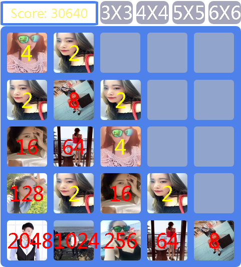

## JS原生PC端2048小游戏
### 游戏简介
>《2048Numberpuzzlegame》是一款数字益智游戏，而《2048》的初始数字则是由2+2组成的基数4。在操作方面的不同则表现为一步一格的移动，变成更为爽快的一次到底。相同数字的方况在靠拢、相撞时会相加。系统给予的数字方块不是2就是4，玩家要想办法在这小小的16格范围中凑出「2048」这个数字方块。
### 操作说明
使用键盘方向键↑↓→←即可轻松操作。所有的数字方块都会往按键方向靠拢，系统也会在空白的地方随机出现一个数字方块（2&4），相同数字的方块在靠拢、相撞时会相加。祝你尽快突破‘2048’哦(*^__^*) ~
### 技术应用
简单的HTML+CSS，javascript原生实现逻辑算法。
### 演示图示

### PS：
四种方块模式可选[3*3,4*4,5*5,6*6]，可自设个数字图像，增强趣味性。
